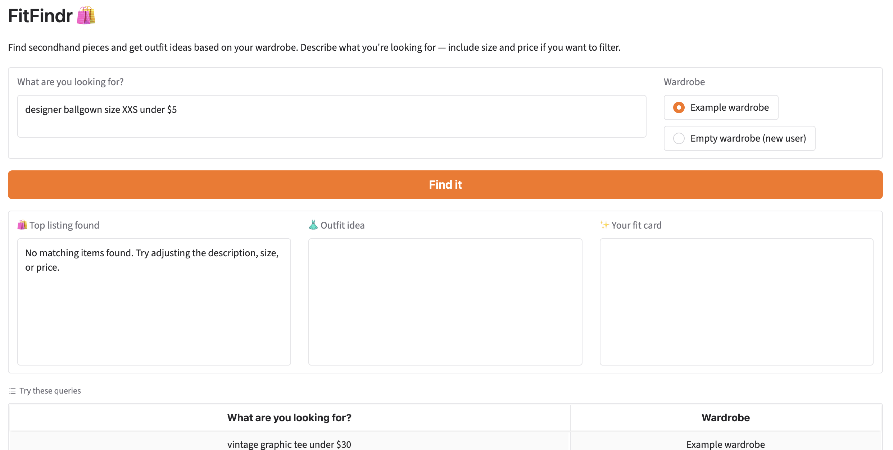

# FitFindr 🛍️

FitFindr is a multi-step styling agent for secondhand fashion. You describe what you're
looking for; it searches a mock listings dataset, suggests an outfit built from your existing
wardrobe, and writes a shareable "fit card" caption for the find.

## Setup

```bash
pip install -r requirements.txt
```

Add your Groq API key to a `.env` file in the project root:

```
GROQ_API_KEY=your_key_here
```

Run the app:

```bash
python app.py      # Gradio UI
python agent.py    # CLI: happy-path + no-results demo
pytest tests/      # test suite
```

## Tool Inventory

| Tool | Inputs | Output | Purpose |
|------|--------|--------|---------|
| `search_listings` | `description` (str), `size` (str \| None), `max_price` (float \| None) | `list[dict]` of listings, sorted by relevance (best first); `[]` if nothing matches | Filters the 40-item listings dataset by size/price and ranks the rest by keyword overlap with the description. |
| `suggest_outfit` | `new_item` (dict), `wardrobe` (dict with `items`) | `str` — 1–2 outfit ideas naming wardrobe pieces, or general styling advice if the wardrobe is empty | Uses the LLM (`llama-3.3-70b-versatile`) to pair the chosen listing with the user's existing clothes. |
| `create_fit_card` | `outfit` (str), `new_item` (dict) | `str` — a 2–4 sentence casual OOTD caption mentioning the item, price, and platform | Turns the selected item + outfit into a shareable social caption (high temperature so captions vary). |

## How the Planning Loop Works

`run_agent()` parses the query into a description, size, and `max_price`, then calls
`search_listings`. The result drives the branch: if the list is empty it sets
`session["error"]` with a helpful message and **returns early**, never calling the downstream
tools with empty input. Otherwise it selects the top result and proceeds through
`suggest_outfit` and `create_fit_card`, so the agent's behavior genuinely differs between a
matching query and a no-match query rather than always running the same sequence.

## State Management

All state for one interaction lives in a single `session` dict created by `_new_session()`,
holding the query, parsed params, search results, selected item, wardrobe, outfit suggestion,
fit card, and any error. Each step writes its output into the session, and the next step reads
from it — `suggest_outfit` receives the exact `selected_item` stored after search, and
`create_fit_card` receives the stored `outfit_suggestion`. Nothing is re-derived or
re-requested from the user mid-run, and the completed session dict is what the UI maps to its
three panels.

## Error Handling

| Tool | Failure mode | Response |
|------|--------------|----------|
| `search_listings` | No listing matches the query | Returns `[]` (never raises); the loop sets an error telling the user to adjust the description, size, or price and stops. |
| `suggest_outfit` | Wardrobe is empty | Returns general styling advice as a string instead of failing, so the user still gets value. |
| `create_fit_card` | Empty/whitespace outfit string | Returns a descriptive error string instead of calling the LLM or raising. |

**Concrete example from testing** — calling `create_fit_card("", item)` returns:

```
Couldn't generate a fit card: the outfit suggestion was empty. Try finding an item and building an outfit first.
```

and the impossible query `search_listings("designer ballgown", size="XXS", max_price=5)`
returns `[]`, which the agent surfaces as *"No matching items found. Try adjusting the
description, size, or price."* As a safety net, the loop also wraps the LLM steps so an API
failure degrades into a clean `session["error"]` rather than crashing the UI.

[](./designer-ballgown-error.png)

## Spec Reflection

Writing the spec first helped most on the planning loop: deciding the empty-results branch and
the session fields up front meant the implementation was a direct translation rather than a
guess. The implementation diverged from the original `planning.md` on the Tool 2/3 signatures —
the draft described `suggest_outfit` as returning a dict and `create_fit_card` as taking only
`outfit` — so I followed the starter code's actual signatures (which `agent.py` already calls)
and updated planning.md to match.

## AI Usage

- **`search_listings`:** I gave Claude the Tool 1 spec block (inputs, return value, failure
  mode) and asked it to implement the function using `load_listings()`. The first design was
  reasonable, but I had it factor the tokenizing/scoring into shared helpers and add a stopword
  list so generic words ("looking", "size") didn't inflate relevance, then verified it with
  pytest tests for the price filter and the empty-results case.
- **Planning loop:** I gave Claude the architecture diagram plus the Planning Loop and State
  Management sections and asked it to implement `run_agent()`. I reviewed that it branched on
  the search result and returned early on `[]` instead of calling all three tools
  unconditionally, and I added a try/except around the LLM steps myself so an API error
  degrades gracefully rather than crashing the caller.
