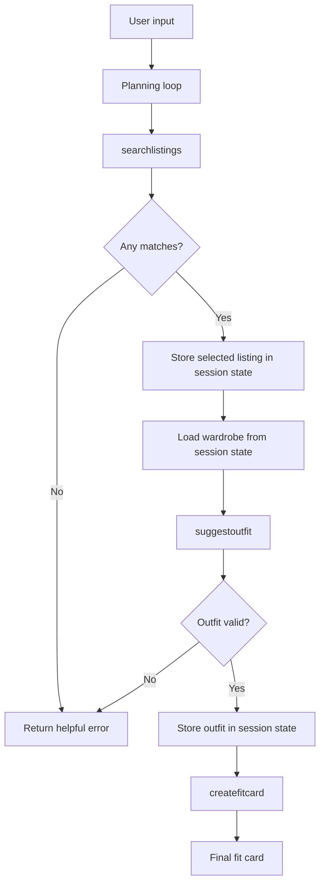

# FitFindr — planning.md

> Complete this document before writing any implementation code.
> Your spec and agent diagram are what you'll use to direct AI tools (Claude, Copilot, etc.) to generate your implementation — the more specific they are, the more useful the generated code will be.
> Your planning.md will be reviewed as part of your submission.
> Update it before starting any stretch features.

---

## Tools

List every tool your agent will use. For each tool, fill in all four fields.
You must have at least 3 tools. The three required tools are listed — add any additional tools below them.

### Tool 1: search_listings

**What it does:**
<!-- Describe what this tool does in 1–2 sentences -->
`search_listings` finds the top 3 listings of clothing 

This tool searches the listings dataset for items that match a user’s description, size, and budget. It ranks the best matches by relevance and returns the top results.

**Input parameters:**
<!-- List each parameter, its type, and what it represents -->
- `description` (str): a string containing traits about a piece of clothing. 
- `size` (str): a label such as M or L describing the size.
- `max_price` (float): upper bound on the most the user would pay for this clothing. 

**What it returns:**
<!-- Describe the return value — what fields does a result contain? -->
It outputs 3 listings that are ranked by relevance.  

**What happens if it fails or returns nothing:**
<!-- What should the agent do if no listings match? --> Returns an empty result and tell the agent to respond that nothing was found for the search criteria.
---

### Tool 2: suggest_outfit

**What it does:**
<!-- Describe what this tool does in 1–2 sentences -->
Takes the selected listing and the user’s wardrobe, then suggests items from the wardrobe that work well with the new item.

**Input parameters:**
<!-- List each parameter, its type, and what it represents -->
- `new_item` (dict): the item to be added. 
- `wardrobe` (dict): the clothes from the user's existing wardrobe. 

**What it returns:**
<!-- Describe the return value -->
A non-empty **string** describing 1–2 suggested outfits that pair the new item with named wardrobe pieces. If the wardrobe is empty, it returns general styling advice as a string instead.

**What happens if it fails or returns nothing:**
<!-- What should the agent do if the wardrobe is empty or no outfit can be suggested? -->
Return graceful failure so the agent can explain that the outfit cannot be built yet. 

---

### Tool 3: create_fit_card

**What it does:**
<!-- Describe what this tool does in 1–2 sentences -->
From the selected item and suggested outfit, generates fit card and/or outfit summary. 

**Input parameters:**
<!-- List each parameter, its type, and what it represents -->
- `outfit` (str): the outfit suggestion string returned by `suggest_outfit`.
- `new_item` (dict): the selected listing dict (used for the item's name, price, and platform).

**What it returns:**
<!-- Describe the return value -->
A 2–4 sentence shareable caption **string** (casual OOTD style) that mentions the item name, price, and platform once each. If `outfit` is empty, it returns a descriptive error string instead of raising.

**What happens if it fails or returns nothing:**
<!-- What should the agent do if the outfit data is incomplete? --> Return an error so the agent can stop and explain what information is missing.
---

### Additional Tools (if any)

<!-- Copy the block above for any tools beyond the required three -->

---

## Planning Loop

**How does your agent decide which tool to call next?**
<!-- Describe the logic your planning loop uses. What does it look at? What conditions change its behavior? How does it know when it's done? -->

The agent first reads the user request and extracts search constraints. It calls the listing search tool, checks whether any results were returned, then either stops with an error message or stores the best result and moves on to outfit suggestion. After that, it generates the final fit card and ends the interaction.

---

## State Management

**How does information from one tool get passed to the next?**
<!-- Describe how your agent stores and accesses state within a session. What data is tracked? How is it passed between tool calls? -->

The agent stores the user’s search query, the matched listing, the wardrobe data, the suggested outfit, and the final fit card in session state. Each later tool reads the data from the previous step instead of asking the user to repeat it.

---

## Error Handling

For each tool, describe the specific failure mode you're handling and what the agent does in response.

| Tool | Failure mode | Agent response |
|------|-------------|----------------|
| search_listings | No results match the query | Agent tells the user no matching items were found and suggests changing the size, price, or description. |
| suggest_outfit | Wardrobe is empty | Agent says it cannot suggest an outfit yet and asks the user to add wardrobe items.|
| create_fit_card | Outfit input is missing or incomplete | Agent explains that it could not generate the fit card because the outfit data was incomplete.|

---

## Architecture

<!-- Draw a diagram of your agent showing how the components connect:
     User input → Planning Loop → Tools (search_listings, suggest_outfit, create_fit_card)
                                                                          ↕
                                                                   State / Session
     Show what triggers each tool, how state flows between them, and where error paths branch off.
     ASCII art, a Mermaid diagram (https://mermaid.js.org/syntax/flowchart.html), or an embedded
     sketch are all fine. You'll share this diagram with an AI tool when asking it to implement
     the planning loop and each individual tool. -->

---

## AI Tool Plan

<!-- For each part of the implementation below, describe:
     - Which AI tool you plan to use (Claude, Copilot, ChatGPT, etc.)
     - What you'll give it as input (which sections of this planning.md, your agent diagram)
     - What you expect it to produce
     - How you'll verify the output matches your spec before moving on

     "I'll use AI to help me code" is not a plan.
     "I'll give Claude my Tool 1 spec (inputs, return value, failure mode) and ask it to implement
     search_listings() using load_listings() from the data loader — then test it against 3 queries
     before trusting it" is a plan. -->

     I plan to use Claude. 

     When stuck, provide 1 clearly defined problem, give 3 potential options for how to overcome it, and 1 recommendation and the intuition behind it. Do not proceed implementing any of the options until I confirm. 

     Avoid duplicated logic and repeated code.
     If you’re about to copy/paste similar code, STOP and reconsider the design.
     Refactor often: extract shared helpers/utilities/modules so changes happen in one place.

     Always test first. Before writing any code, you must always check the tests. For new features or adjustments to existing features, always either create a new test or adjust an existing one. Following existing testing patterns. Confirm the test with the user before implementing it.

     For complex, multi-step tasks, write a plan and a to do list for yourself before you start executing. 
      

**Milestone 3 — Individual tool implementations:**

I gave Claude one Tool block from this planning.md at a time (inputs, return value, failure mode) and asked it to implement that single function in `tools.py`, reusing `load_listings()` instead of re-reading files. Before trusting each function I checked it against the spec — does `search_listings` filter by all three params and return `[]` (not raise) on no match? Do the LLM tools use `llama-3.3-70b-versatile` and handle the empty-wardrobe / empty-outfit cases? I confirmed each with pytest tests (one per failure mode) before moving on, and ran `create_fit_card` several times to verify the caption varied.

**Milestone 4 — Planning loop and state management:**

I gave Claude the Architecture diagram plus the Planning Loop and State Management sections and asked it to implement `run_agent()` to match. I reviewed that the generated loop actually branches on the `search_listings` result (sets `session["error"]` and returns early on `[]`, rather than calling all three tools unconditionally) and that each tool's output is stored in the session dict and read by the next step. I verified with a live happy-path run and the built-in no-results case before wiring `handle_query()` in `app.py`.

---

## A Complete Interaction (Step by Step)

Write out what a full user interaction looks like from start to finish — tool call by tool call. Use a specific example query.

**Example user query:** "I'm looking for a vintage graphic tee under $30. I mostly wear baggy jeans and chunky sneakers. What's out there and how would I style it?"

**Summary:** When this query is submitted (the "Find It" button), the agent parses it into a description, size, and price, then calls `search_listings`. If nothing matches, it stops and tells the user what to change. If there are matches, it takes the top one and passes it (with the wardrobe) to `suggest_outfit`, then feeds that outfit and the item into `create_fit_card` to produce the final shareable caption.

**Step 1:**
<!-- What does the agent do first? Which tool is called? With what input? -->
User asks for vintage graphic tee under $30. Agent extracts the description, size if present, and price limit, and calls listing search tool. 

**Step 2:**
<!-- What happens next? What was returned from step 1? What tool is called now? -->
Tool returns and shortlists matching listings. Agent chooses best result and stores it in state. 

**Step 3:**
<!-- Continue until the full interaction is complete -->
Agent passes chosen item and wardrobe into outfit suggestion tool. Outfit suggestion is returned and stored in state. Agent calls the fit card generator and produces a final shareable outfit summary.

**Final output to user:**
<!-- What does the user actually see at the end? -->
Short summary of the item, outfit pairing, and styling suggestion.
